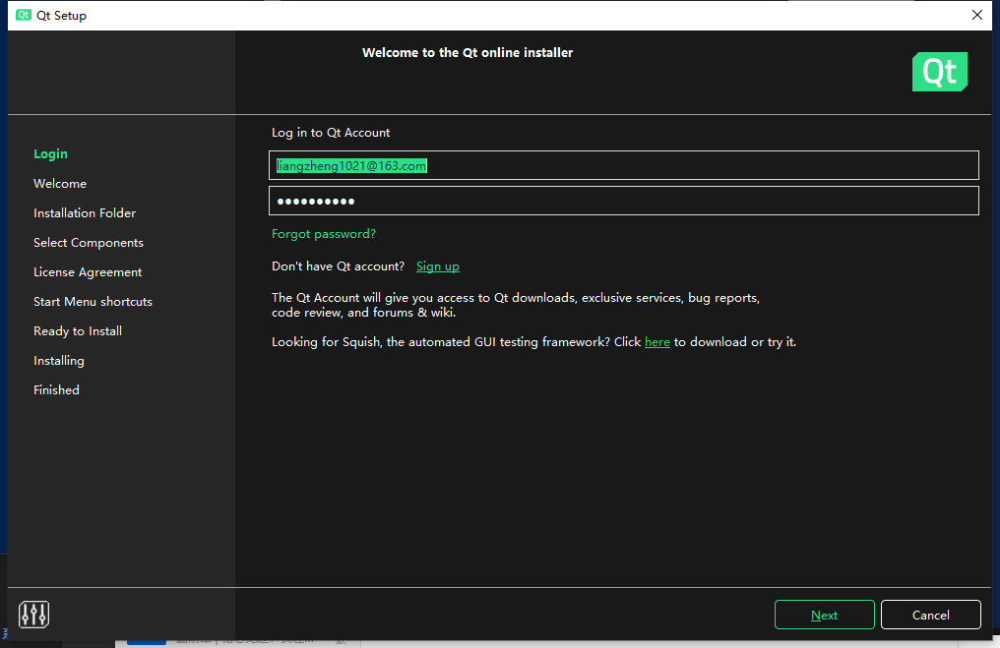

# 目标
控制宇宙线缪子成像系统中用到的电子学板。

# 依赖
- ROOT (Windows version >= 6.20, compiler version = msvc2019)
    下载链接：参考 https://root.cern.ch/
- Qt5 (Not Qt6, version >= Qt 5.12, compiler version = msvc2019)
    下载教程：
    - 在线安装：
        - 下载Qt5 open source online installer: https://www.qt.io/download-open-source
        - 如果需要更快的下载速度，建议更换镜像源，更换方式为：在下载目录中打开powershell，输入".\qt-opensource-windows-x86-5.12.12.exe --mirror https://mirrors.cloud.tencent.com/qt/"，这是腾讯的源，测试速度尚可。
        
        - 注册Qt账号
        - 打开在线下载器，按照提示安装，期间会提示登录账号。
        
        - 在线安装默认隐藏了Qt5的选项，需要取消勾选 Latest supported releases 并点击Filter，刷新列表。选择Qt 5.12以上的版本。
        
    - 离线安装：
        - 链接：https://www.qt.io/offline-installers/ 选择感兴趣的安装包，建议Qt 5.12或Qt 5.15，亲测速度较慢。
- Visual studio (MSVC version == msvc2019)
    下载链接：https://visualstudio.microsoft.com/ ，下载社区版
    - 安装桌面开发套件，至少安装一个编译器msvc2019，其他的按照需求安装即可。

## 环境配置
> 将路径添加到系统的环境变量，添加方法：  
在开始菜单中搜索“编辑系统环境变量”->“环境变量”->“Path”->新建
> - C:\root_version...\bin
> - E:\Qt\5.15.2\msvc2019_64\bin
> - ...

# 用法功能
## 项目编译
> 本项目使用CMake组织结构，能够轻易移植到其它系统，但因为与电子学板通信时使用的是WIN32 sock库，因此需要进一步改动。如有移植到Linux下的需求，可以进一步修改。**但项目目前仅能在windows系统下配合Qt5编译。**
- CMakeLists.txt:
    - 设置了多个变量作为模块编译开关：USE_VISA，USE_ZABER， USE_VLD_CHECK，分别用于电子学测试时与信号发生器等VISA设备进行通信，闪烁体测试时与ZABER移动平台进行通信，以及程序内存泄漏检测使用，**默认为OFF状态**，如果发现为ON，**请手动改成OFF。**如果为ON状态，且没有安装相应的库或者未配置好相应的环境，则编译失败。
    
    - 设置了多个变量作为功能选项：DISABLE_AUTO_ENABLE_TDC， DISABLE_AUTO_DRAW_WHILE_DAQ， 分别用于取消TDC的自动使能，取消自动画图功能，**默认为OFF状态**，如果发现为ON，**请手动改成OFF。**如果为ON状态，则TDC不会在StartDAQ时自动使能，因而不可能取到数据；或者不会显示探测器取到的能谱。
    

- 项目结构：
    > 本项目会生成两个可执行程序：MultiBoard.exe, SingleBoard.exe，具体使用在后续详细介绍
    > - SingleBoard：用于单块板的测试，并可以实时监控探测器能谱。
    > - MultiBoard：用于系统的取数与多块板的调试。
    <!--  -->
    <!--  -->

- 编译：
    - 打开Qt creator
      - 如果没有Qt creator，则需要打开在线安装器，在filter界面选中Qt creator，并继续安装。
    
    - 打开项目，选择CMakeLists.txt。
    
    - 在配置项目界面选择Desktop Qt 5.1.2 MSVC 2019 64 bit。
    
    - 左下角编译，选择需要运行的文件。
    

## 单板测试

## 多板联合取数 & 系统测试

# FAQ

- If ROOT Canvas work inappropriately, try add "TApplication(argc, argv)"